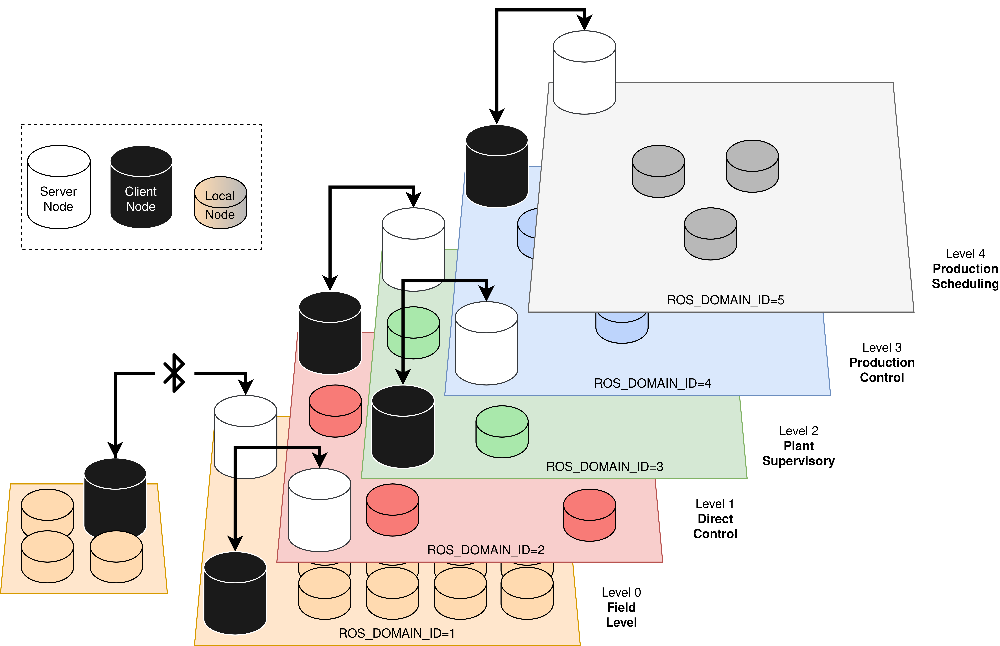

# ros2_socket_bridge

**README and the project is still under development. Do you have questions or feature requests? Contact me at mortemd@stud.ntnu.no.**

<p align="center">
  
</p>


The ros2_socket_bridge package is made to enable node communication across different domains or computers using the built-in python socket package. This enables the transmission of messages using TCP/IP or bluetooth.

By utilizing subscribers and publishers combined with sockets, the package allows the transfer of ROS-style messages between a server and client. The messages can be sent between computers or devices by the use of TCP/IP or bluetooth, which opens up many possibilities such as cross-domain communication or communication with devices that only has bluetooth receivers.

An example use-case could be where the user wants to restrict the amount of topics per domain, such as for example robot fleets, where multiple robots have their own navigation software. A behaviortree could be running on a separate domain where it could send commands to each robot without confusing topic namespaces.

For additional documentation, see [ReadTheDocs](https://ros2-socket-bridge.readthedocs.io).

The package is made as part of a masters thesis in "Mechanical Engineering - Robotics and Automation" at NTNU, spring 2021.

The package currently only works with topics - not services or actions.

## Installation
Install from source by navigating to the folder you wish to install in. Run ```git clone``` followed by the git URL to download the package. Once downloaded, navigate inside the folder and build using ```colcon build```. Remember to source the 'install/setup.bash' file after installation. Two additional packages, rsb_server and rsb_client, should now be listed in the package list (```ros2 pkg list```).

### Requirements
* Python 3.6+
* ROS2 'Foxy Fitzroy'
* 'Cryptography' Python package (pip install cryptography)


## Setup
The use case for this package is only set by imagination, however it does require a little bit of configuration to work with any topic.

### Generating an encryption key
Due to security risks using the pickle package, all messages are encrypted when sent. To encrypt messages, an encryption key is needed. This can be any 32 url-safe base64-encoded bytes object, and you can generate one by running the 'generate_key.py' script located in the main folder of ros2_socket_bridge.

Navigate to the ros2_socket_bridge folder and run
```
$ python3 generate_key.py
```
A file named 'key.txt' containing your key should appear in the main folder. It is important that both the server and the client has the same key to be able to decrypt messages. Where to set the encryption key will be explained in the following sections.

### Server setup
The server requires that you set ```server_ip``` in the 'src/rdb_server/config/bringup.yaml' file to the IP of your computer which is running the server node. This could also be the local IP of the computer if you are planning on transferring the topics locally. If you prefer to use bluetooth, the ```server_ip``` should be set to the MAC address belonging to the bluetooth device running the server node. To get this address, simply run ```hciconfig``` and look for "BD Address". Remember to connect the two devices that are communicating over bluetooth.

After this, open the launch file 'src/rsb_server/launch/server.launch.py'. This is where you select the robot name (which must match with the client), the port to be used as main communication between server and client, and finally your encryption key.

This is all the setup required to run the server. Topics to be transmitted or received, protocols and QoS is all set at the client.

### Client setup
The main client setup is done in the 'src/rdb_client/config/bringup.yaml' file. In the file you will find a detailed description of all variables required.

First, set the ```server_ip``` and ```server_port``` variables. These must match with whatever you set up in the server.

Everything starting with ```receive_``` will be directed to topics that are going to be sent from the server to the client. The topic name, message type, port, protocol and QoS are required in order to make the node work. 

All settings starting with ```transmit_``` will be sent from the client to the server. The same settings are required as with the receive topics.

Note that if you are using bluetooth, all the protocols should be set to 'BLUETOOTH' for both receive_protocol and transmit_protocol.

Configure the launch file by navigating to 'src/rdb_client/launch/client.launch.py'. Insert the robot_name and encryption key to match with the server.


After configuring both server and client, remember to build and source the setup file.

## Example
TODO.

## Contributing
Pull requests are welcome. For major changes, please open an issue first to discuss what you would like to change.

Please make sure to update tests as appropriate.

## License
[APACHE LICENSE, VERSION 2.0](https://www.apache.org/licenses/LICENSE-2.0)
