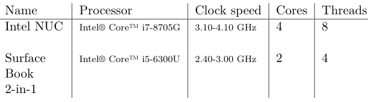
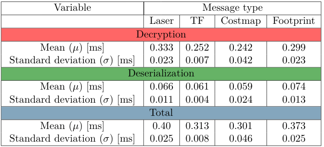
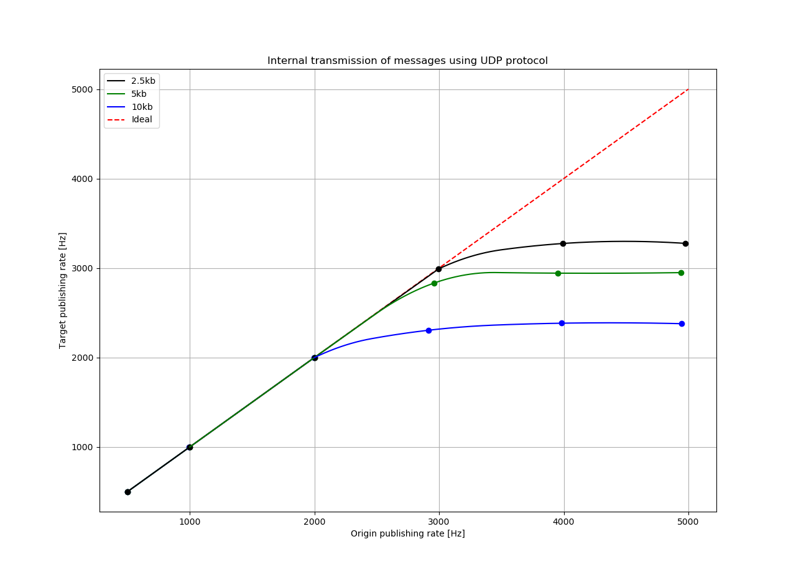
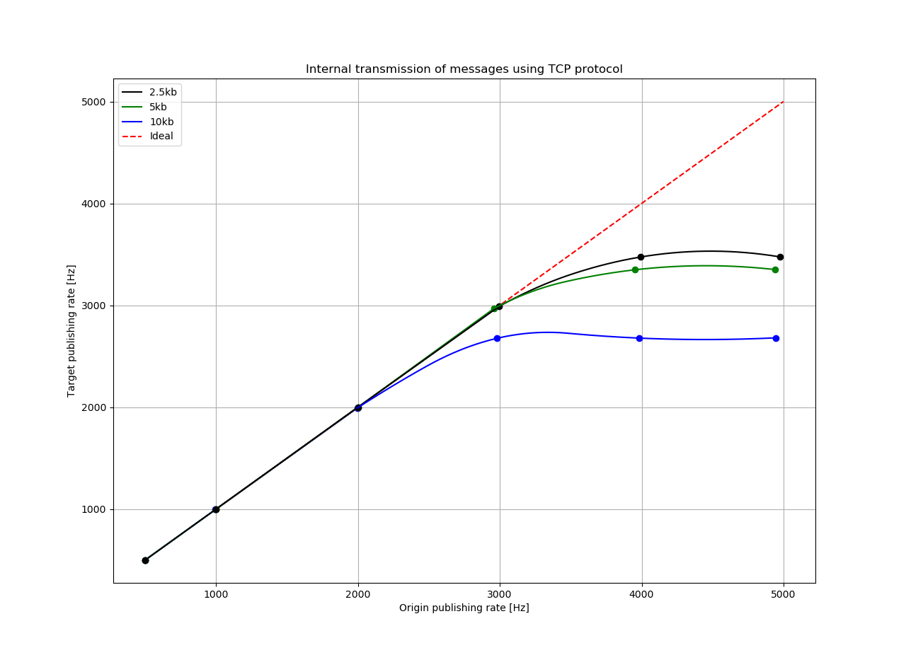
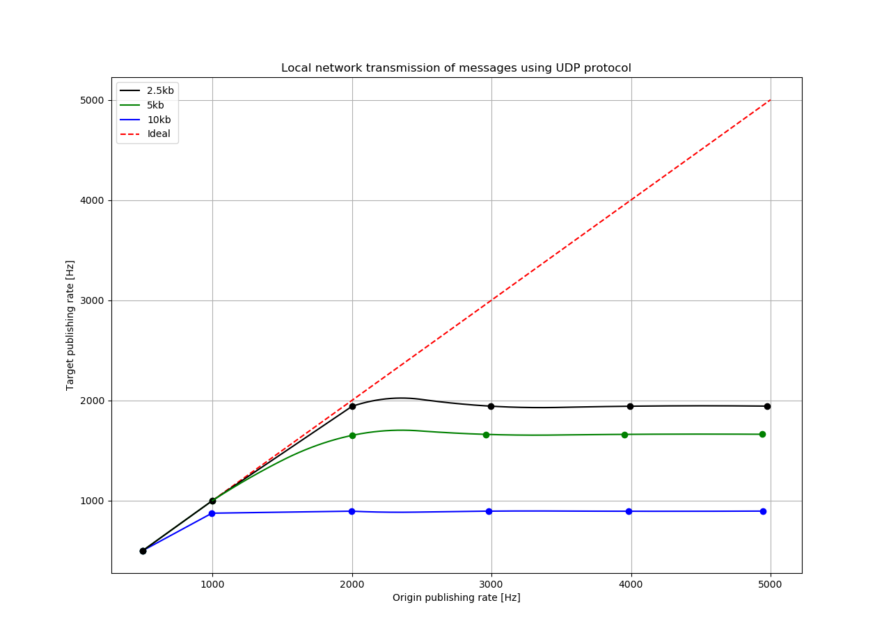

Testing and benchmarking
========================
As this software was made in relation to a masters thesis, testing and benchmarking was done. Time it took to serialize and encrypt, deserialize and decrypt, and maximum topic publishing rate using different protocols and connection modes was tested.

Details about the two computers used during testing can be seen here;

Serialization and encryption
^^^^^^^^^^^^^^^^^^^^^^^^^^^^
.. image:: images/se.png
  :width: 600

Decryption and deserialization
^^^^^^^^^^^^^^^^^^^^^^^^^^^^^^

Maximum publishing rate
^^^^^^^^^^^^^^^^^^^^^^^
The maximum publishing rate was tested in relation to message size.

Internal transmission using UDP:

Internal transmission using TCP:

External (between computers on local network) transmission using UDP:

External transmission using TCP:

.. image:: images/rate_external_TCP.png
  :width: 600

External transmission using Bluetooth:

.. image:: images/blu_rate.png
  :width: 600